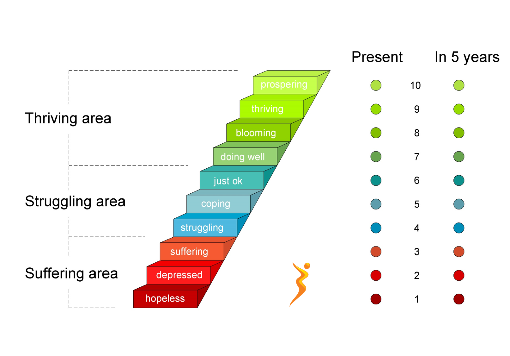

```{r setup, echo=FALSE}
 knitr::opts_chunk$set(echo=TRUE, warning = FALSE, message = FALSE)
```

# Introduction

The life expectancy of a country tells us its citizens' expected (average) age at the time of their deaths. Just as their is global economic inequality, there is also inequality in health in realms as basic as life expectancy and life satisfaction. How can we use data on these outcomes to present a story about life expectancy? ourworldindata.org is a website that compiles data from international organizations such as the World Bank, WHO, etc. 

Data is downloaded from a graphical user interface.

# Load Packages

```{r pack}
library(tidyverse)
library(janitor)
require(ggrepel)
require(ggspatial)
require(sf)
require(rnaturalearth)
require(rnaturalearthdata)
require(maps)
require(tools)
library(kableExtra)
theme_set(theme_bw())
```

# Life Expectancy Itself

I first downloaded some data on Life Expectancy itself. This is a simple dataset listing country name and life expectancy by different years. We can observe differences in life expectancy between 1950 and 2019.

```{r le map}
#import data and clean names
le <- read_csv('life-expectancy.csv') %>% clean_names()

#obtain world coordinate info
world <- ne_countries(scale = "small", returnclass = "sf")
#change 3 letter abbreviation colname to code for later merging
# colnames(world)[45] <- "code"
world <- rename(world, code = iso_a3)
world <- select(world, code, geometry,region_un)

#filter data by 2019 and 1950
le2019 <- filter(le, year == 2019) %>% drop_na()
le1950 <- filter(le, year == 1950) %>% drop_na()
le2019$diff <- le2019$life_expectancy - le1950$life_expectancy
```

After cleaning up the data, we can generate some world maps and some tables of the countries with the highest and lowest life expectancies in 2019. Inequalities exist all across the map, however all three maps together demonstrate that inequality has persisted the most in Subsaharan African countries. We can also observe that island countries appear to have the highest life expectancies, which some claim to be due to their diets. Hong Kong is listed as a country due to an atypical political status.

```{r le map 2}

#merge data with world coordinates and generate plots
worldle2019 <- right_join(world,le2019)
worldle2019p <- worldle2019 %>% ggplot() + geom_sf(aes(fill = life_expectancy)) + scale_fill_continuous(low='red', high = 'white') + labs(fill="Life Expectancy (years)") +   theme(axis.text.x = element_blank(),
        axis.text.y = element_blank(),
        axis.ticks = element_blank(),
        rect = element_blank()) + ggtitle('Heatmap of Life Expectancy in 2019')
worldle1950 <- right_join(world,le1950)
worldle1950p <- worldle1950 %>% ggplot() + geom_sf(aes(fill = life_expectancy)) + scale_fill_continuous(low='red', high = 'white') + labs(fill="Life Expectancy (years)")  + theme(axis.text.x = element_blank(),
        axis.text.y = element_blank(),
        axis.ticks = element_blank(),
        rect = element_blank()) + ggtitle('Heatmap of Life Expectancy in 1950')

worldlediffp <- worldle2019 %>% ggplot() + geom_sf(aes(fill = diff)) + scale_fill_continuous(low='red', high = 'white') + labs(fill="Life Expectancy (years)")  + theme(axis.text.x = element_blank(),
        axis.text.y = element_blank(),
        axis.ticks = element_blank(),
        rect = element_blank())+ ggtitle('Heatmap of Life Expectancy difference between 2019 and 1950')

worldle1950p
worldle2019p
worldlediffp

#make tables of highest and lowest life expectancies6
lole <- le2019 %>% arrange(life_expectancy) %>% select(-year)
hile <- le2019 %>% arrange(desc(life_expectancy)) %>% select(-year)
lole <- rename(lole, Country = entity, Code = code, 'Life Expectancy' = life_expectancy, '2019-1950 Difference' = diff)
hile <- rename(hile, Country = entity, Code = code, 'Life Expectancy' = life_expectancy, '2019-1950 Difference' = diff)
kableExtra::kable(head(hile), caption = 'Countries with the Highest Life Expectancy in 2019')
kableExtra::kable(head(lole), caption = 'Countries with the Lowest Life Expectancy in 2019')
```

# Some Visual and Numerical Associations with Life Expectancy

## Extreme Poverty

I downloaded, cleaned, and merged with our last datatset some data on extreme poverty, defined as living on less than $1.90/day.

```{r investigate le, gdp}

#read EP dataset and rename columns
ep <- read_csv('extreme-poverty-headcount-ratio-vs-life-expectancy-at-birth.csv') %>% clean_names %>% select(-continent)
ep <- rename(ep, popunderpov = x1_90_per_day_share_of_population_below_poverty_line, life_expectancy = life_expectancy_at_birth_total_years)

#filter 2019
ep2019 <- filter(ep, year==2019) %>% drop_na(popunderpov) %>% drop_na(life_expectancy)

#merge with world for region info
worldep2019 <- right_join(world, ep2019)

```

Then I generated some scatterplots of the percent population in extreme poverty and life expectancy. Countries with low life expectancy tend to have more people living in extreme poverty. Extreme poverty means poor living conditions, which means poorer health and higher rates of illness and infant/child mortality.

```{r investigate le, gdp 2}

#generate plots of extreme poverty and life expectancy
worldep2019 %>% ggplot(aes(x= popunderpov, y=life_expectancy, color=region_un, label=code)) + geom_point(size=3) + labs(y='Life Expectancy (years)',x='Percentage of Population in Extreme Poverty (<$1.90/day)',title="Life Expectancy and Population in Extreme Poverty by Region") +geom_text_repel(max.overlaps = 20) + scale_color_discrete(name="Region") + theme(text = element_text(size = 20))
worldep2019 %>% ggplot(aes(x= popunderpov, y=life_expectancy, label=code)) + geom_text_repel() + geom_point(size=3) + facet_wrap(~region_un) + labs(y='Life Expectancy (years)',x='Percentage of Population in Extreme Poverty (<$1.90/day)',title="Life Expectancy and Population in Extreme Poverty by Region") + theme(text = element_text(size = 20))
                       

```

## Life Satisfaction 

I downloaded, cleaned, and merged with our initial datatset some data on life satisfaction, defined on a scale of 0-10 with the Cantril Ladder

```{r le ls, fig.cap="Picture: Cantril Ladder Scale that measures Life Satisfaction", out.width = "100%"}
ls <- read_csv('life-satisfaction-vs-life-expectancy.csv') %>% clean_names() %>% select(entity, code, year, life_satisfaction_in_cantril_ladder_world_happiness_report_2021) %>% drop_na(life_satisfaction_in_cantril_ladder_world_happiness_report_2021) %>% drop_na(code)
ls <- rename(ls, life_satisfaction = life_satisfaction_in_cantril_ladder_world_happiness_report_2021)
ls2019 <- filter(ls, year==2019)
lels2019 <- right_join(le2019,ls2019)
worldlels2019 <- right_join(world, lels2019)



```

Then I generated some scatterplots of life satisfaction and life expectancy. Looks like life satisfaction, life expectancy, and extreme poverty are related, let's look at that next.

```{r le ls 2}
worldlels2019 %>% ggplot(aes(x= life_satisfaction, y=life_expectancy, color=region_un, label=code)) + geom_point(size=3) + geom_text_repel(max.overlaps = 10) + scale_color_discrete(name="Region") + labs(y='Life Expectancy (years)',x='Life Satisfaction (1-7)',title="Life Expectancy and Life Satisfaction by Region") + theme(text = element_text(size = 20))
worldlels2019 %>% ggplot(aes(x= life_satisfaction, y=life_expectancy, label=code)) + geom_text_repel() + geom_point(size=3) + facet_wrap(~region_un) + labs(y='Life Expectancy (years)',x='Life Satisfaction (1-7)',title="Life Expectancy and Life Satisfaction by Region") + theme(text = element_text(size = 20))


```

## Life Satisfaction and Extreme Poverty

A correlation matrix of life satisfaction, extreme poverty, and life expectancy made by merging all our datasets so far.

```{r corrmat}
library(GGally)

eplels2010 <- right_join(lels2019, ep2019)

ggpairs(eplels2010, columns = c(4, 6, 7), columnLabels = c('Life Expectancy', 'Life Satisfaction', '% Pop. under $1.90/day')) + theme(text = element_text(size = 15))
```

## Life Satisfaction and Religion

There is a link in the psychological literature between life satisfaction and religion. Religion seems to be protective in some way. I downloaded, cleaned, and merged some data on the world's religious practices, measured as each population's majority religion. Note the below religion data was for 2010, so life satisfaction and life expectancy used here are also from 2010 for the sake of integration.

```{r le religion}

rel <- read_csv('main-religion-of-the-country-in.csv') %>% clean_names() %>% drop_na(main_religion)
le2010 <- filter(le, year == 2010) %>% drop_na
ls2010 <- filter(ls, year == 2010)
relle2010 <- right_join(le2010, rel)
rellels2010 <- right_join(relle2010,ls2010)
worldrellels2010 <- right_join(world,rellels2010)

```

I then regenerated our life satisfaction x life expectancy scatterplots, including religion as a new piece of information. There seems to be clustering of an Islamic group of countries and Christian group of countries in Africa.

```{r le religion 2}
worldrellels2010 %>% ggplot(aes(x = life_satisfaction, y=life_expectancy, color=main_religion, shape=region_un)) + geom_point(size=3) + scale_color_discrete(name="Religion") + theme(text = element_text(size = 20)) + labs(y='Life Expectancy (years)',x='Life Satisfaction (1-7)',title="Life Expectancy and Life Satisfaction by Region and Religion")
worldrellels2010 %>% ggplot(aes(x= life_satisfaction, y=life_expectancy, color=main_religion)) + geom_point(size = 3) + facet_wrap(~region_un) + scale_color_discrete(name='Religion') + theme(text = element_text(size = 20)) + labs(y='Life Expectancy (years)',x='Life Satisfaction (1-7)',title="Life Expectancy and Life Satisfaction by Region and Religion")
```

## Interpersonal Trust

```{r le interpersonal trust}

it <- read_csv('self-reported-trust-attitudes.csv') %>% clean_names() 
it <- rename(it, interpersonal_trust = trust_in_others_world_values_survey_2014)
it2014 <- filter(it, year==2014) 
le2014 <- filter(le, year == 2014) %>% drop_na
ls2014 <- filter(ls, year == 2014)
itle2014 <- right_join(le2014, it2014)
itlels2014 <- right_join(itle2014,ls2014)
worlditlels2014 <- right_join(world,itlels2014)

worlditlels2014 %>% ggplot(aes(y = life_satisfaction, x=interpersonal_trust, color=region_un)) + geom_point(size=3) + scale_color_discrete(name="Region") + theme(text = element_text(size = 20)) + labs(x='Interpersonal Trust',y='Life Satisfaction (0-10)',title="Life Satisfaction and Interpersonal Trust")
worlditlels2014 %>% ggplot(aes(y = life_expectancy, x=interpersonal_trust, color=region_un)) + geom_point(size=3) + scale_color_discrete(name="Region") + theme(text = element_text(size = 20)) + labs(x='Interpersonal Trust',y='Life Expectancy (Years)',title="Life Expectancy and Interpersonal Trust")


```

# Summary

1. Life expectancy has radically changed over time. People are living longer all over the world but there is still inequality.
1. Extreme Poverty, Life Satisfaction, and Life Expectancy are all correlated
1. There seems to be some interesting clustering in Africa by religion in terms of life expectancy and life satisfaction - this may be regional.

There is a lot to say about life expectancy from a global perspective. Ourworldindata is a great online resource to examine this while using the skills from this course.


